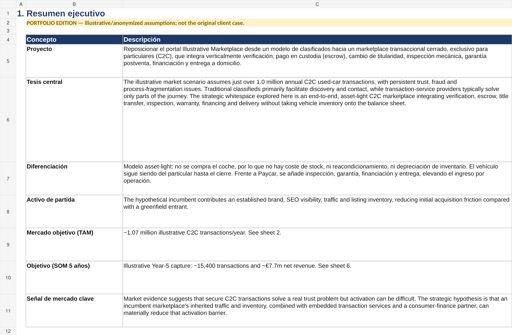
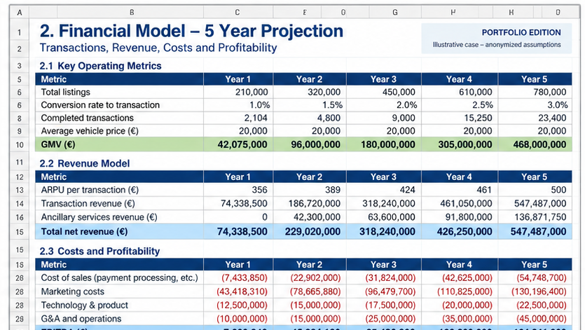
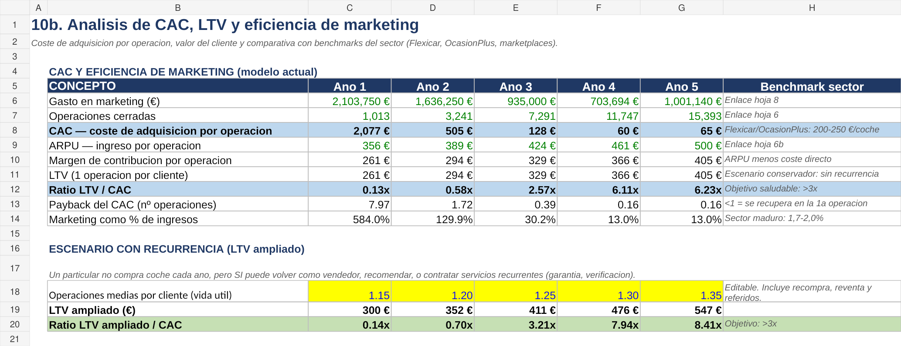
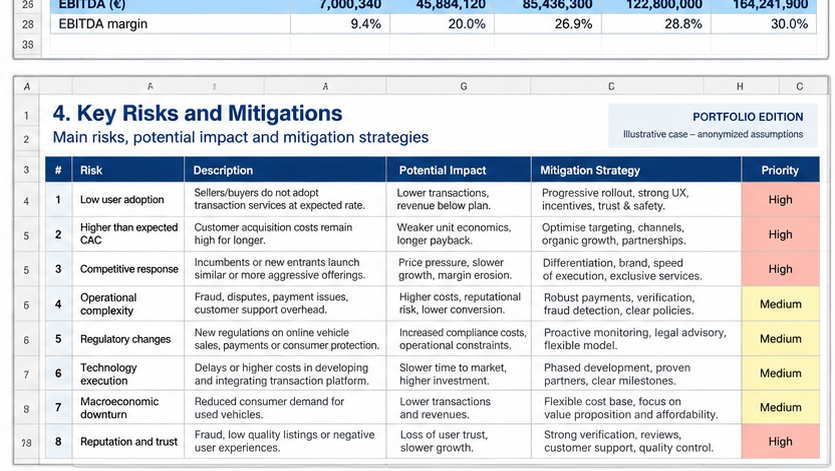

# From Classifieds to Transactions

### Designing an Asset-Light C2C Automotive Marketplace

**AI-assisted corporate strategy, business-model innovation and integrated financial planning**

This portfolio case study explores how an established automotive classifieds platform could evolve from **listing and lead generation** into a **trusted, transaction-enabled C2C marketplace** — while remaining asset-light and avoiding vehicle inventory risk.

> **Portfolio edition.** Derived from a real strategic business-planning exercise. Company identity, financial values, market assumptions, partner references and selected operating parameters have been anonymized or intentionally modified. The strategic methodology and model architecture have been preserved.



## Executive Question

**How can an established classifieds marketplace capture more value from a vehicle transaction that currently happens largely outside the platform?**

The strategic hypothesis is that an incumbent can use its existing brand, SEO visibility, audience and listing liquidity to move downstream from discovery into **transaction orchestration**.

```text
Classified listing / lead generation
                ↓
        Trusted C2C transaction
                ↓
Verification · Protected Payment · Title Transfer
Inspection · Warranty · Financing · Delivery
                ↓
 Multiple transaction-linked revenue streams
```

The proposed model remains **asset-light**: the marketplace does not purchase or hold the vehicle. It coordinates a trusted transaction layer around buyer and seller.

---

## The Management Problem

This is not simply a product-feature exercise. The case connects five management questions:

1. **Is there a meaningful customer problem?**
2. **Can an incumbent marketplace create a defensible advantage?**
3. **Which capabilities should be built, partnered or outsourced?**
4. **Can the transaction generate attractive unit economics?**
5. **Which assumptions must be validated before committing capital?**

The objective was to create an **integrated decision model**, not just a spreadsheet forecast.

---

## Business-Model Architecture

The transaction journey combines:

**Discovery → verification → inspection/history → financing → protected payment → ownership transfer → warranty → delivery**

The marketplace retains control of the customer journey, product experience, pricing, data and partner orchestration while specialist providers can carry regulated, actuarial or operational risks.

### Potential revenue architecture

| Revenue layer | Strategic role |
|---|---|
| Transaction / protected-payment fee | Core transaction monetization |
| Success fee | Align revenue with completed transactions |
| Inspection margin | Trust + incremental monetization |
| Warranty commission | Risk protection without underwriting directly |
| Vehicle-history verification | Fraud reduction + service revenue |
| Financing commission | Liquidity + high-value ancillary revenue |
| Delivery margin | Convenience + transaction completion |
| Listing visibility | Existing marketplace-style upsell |

The management question is not whether every service should launch simultaneously, but which combination creates enough **trust, conversion and ARPU** to justify the additional operational complexity.

---

## Market & Competitive Logic

The model separates:

**TAM** — total C2C used-car transaction universe  
**SAM** — transactions realistically suitable for a digitally orchestrated journey  
**SOM** — illustrative share that could be captured over a five-year horizon

It also compares three broad competitive models:

- **Classifieds / marketplaces:** audience and liquidity, but limited transaction ownership.
- **Transaction-service providers:** solve selected payment, transfer or verification steps.
- **Inventory-owning retailers:** control more of the journey but require capital and carry inventory risk.

The strategic whitespace explored here is a model that combines the marketplace advantages of the first group with more of the trusted transaction experience of the third — **without owning the inventory**.

---

## Five-Year Financial Model



The integrated model links:

**market capture → transactions → GMV → ARPU → revenue → direct costs → operating expenses → EBITDA → cash requirements**

It also includes scenario and sensitivity analysis around the variables that most directly drive the investment case.

The purpose is to ask:

> **Which assumptions have to be true for this strategy to work — and what happens when they are wrong?**

---

## Unit Economics



The model connects:

**ARPU → direct service cost → contribution margin → CAC → LTV → payback**

C2C is also treated as a **two-sided acquisition problem**. A completed transaction requires both a seller/vehicle and a buyer, so the model considers the economics of acquiring both sides rather than treating CAC as a single undifferentiated marketing number.

This is where an incumbent marketplace's inherited SEO, traffic and listing liquidity may create a structural advantage over a greenfield transactional entrant.

---

## Build vs. Partner Logic

### Capabilities the marketplace should control

- customer journey
- product UX
- transaction orchestration
- pricing and packaging
- data layer
- customer relationship
- conversion optimization
- partner integration

### Capabilities that may be better partnered

- protected / safeguarded payments
- identity / KYC
- official ownership transfer
- mechanical inspection
- warranty underwriting
- vehicle-history data
- consumer finance
- vehicle logistics

The operating principle is to **retain strategic differentiation while externalizing risks that do not create it**.

---

## Risk & Mitigation



The model explicitly challenges the strategy across adoption, marketplace liquidity, legal exposure, partner dependency, data quality and fraud.

Risk is treated as a **design input**, not a footnote to an attractive forecast.

---

## What the Workbook Contains

The repository includes the complete sanitized portfolio model:

### [Download / inspect the illustrative Excel business case](Illustrative_C2C_Automotive_Marketplace_Business_Case.xlsx)

The workbook preserves the interconnected architecture of the original planning exercise across **16 worksheets**:

1. Cover
2. Executive Summary
3. Market Sizing
4. Competitive Benchmark
5. Business Model
6. Partner Architecture
7. Five-Year Financial Model
8. ARPU Detail
9. Expense Assumptions
10. Annual P&L
11. Monthly P&L
12. Cash Flow
13. CAC & LTV
14. Competitive Advantage
15. Risks & Mitigations
16. Notes & Sources

For a deeper explanation of the managerial logic, see **[CASE_STUDY.md](CASE_STUDY.md)**.

---

## Research Discipline

The underlying model includes a dedicated **Notes & Sources** section recording:

- data provenance
- date / context of collection
- discrepancies between sources
- possible explanations
- recommended treatment
- implications for the business case

This matters because a sophisticated financial model is only as useful as the assumptions underneath it.

---

## How AI Assisted the Work

AI was used as an analytical and production accelerator for parts of the project, including:

- structuring research questions
- synthesizing market information
- exploring alternative business-model configurations
- challenging assumptions
- accelerating scenario analysis
- assisting with model construction
- organizing risk and mitigation frameworks
- improving the clarity and structure of the deliverable

The managerial work remained human-led:

- defining the strategic problem
- determining which assumptions mattered
- interpreting conflicting evidence
- deciding which business model was credible
- assessing build-vs-partner decisions
- calibrating commercial assumptions
- evaluating risk
- drawing the final strategic implications

> **AI accelerated the work. It did not own the decision.**

---

## What This Project Demonstrates

**Corporate Strategy · Marketplace Strategy · Business-Model Innovation · Financial Modeling · Unit Economics · Product Strategy · Partnerships · GTM · Risk Analysis · AI-Assisted Research · Executive Decision Support**

My approach to technology and growth problems is:

> **Understand the customer and market → define the strategic opportunity → design the operating model → quantify the economics → identify the risks → determine what management must validate before committing capital.**

---

## Portfolio Context

This project complements my **AI Business Opportunity Mapper**, which demonstrates LLM-enabled product and decision-support development.

Together they represent two sides of the same approach:

**using AI and technology to identify opportunities**  
**+**  
**applying commercial and managerial judgment to turn them into executable business strategies.**

---

## About

**Javier Ortiz Sanz**

Growth & Technology Executive  
**AI · Business Development · International Expansion · Digital Strategy**

This repository is a portfolio case study. It is not an investment recommendation, a current market forecast or a representation of the original client's confidential business plan.
